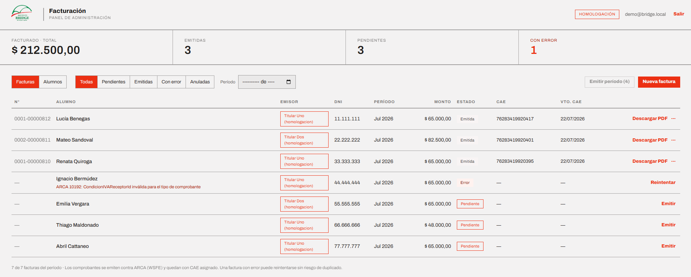

# Bridge — Facturación electrónica

Sistema de facturación electrónica integrado con los web services de **ARCA**
(ex AFIP) de Argentina. Emite Facturas C y Notas de Crédito C contra WSFEv1,
genera el comprobante en PDF con su código QR oficial y administra alumnos,
emisores y comprobantes.

En producción desde agosto de 2026.

---



## Contexto

Un instituto de idiomas factura mensualmente a sus alumnos. Los comprobantes los
emiten dos titulares distintos, cada uno con su CUIT, su punto de venta y su
propio certificado digital. El proceso se hacía a mano, comprobante por
comprobante, desde el portal de ARCA.

El sistema automatiza el ciclo completo: registro de alumnos, generación del lote
mensual, autorización ante ARCA y entrega del PDF.

## Stack

| Capa | Tecnología |
|---|---|
| Backend | Java 21, Spring Boot 4 |
| Persistencia | PostgreSQL, Flyway |
| Frontend | React 18, Vite 5 |
| Integración | SOAP sobre WSAA y WSFEv1, firma CMS con BouncyCastle |
| PDF | iText |
| Infraestructura | Docker Compose, Caddy |
| Testing | JUnit 5, Mockito, Testcontainers |

## Arquitectura

El backend se organiza por dominio y no por capa técnica. Cada paquete
(`alumno`, `factura`, `emisor`, `notacredito`, `arca`, `pdf`, `auth`) agrupa su
entidad, repositorio, servicio, DTOs y excepciones, lo que mantiene acotado el
impacto de cada cambio.

```
alumno/        Padrón de alumnos y condición frente al IVA
emisor/        Titulares: datos fiscales, punto de venta y certificados
factura/       Ciclo de vida del comprobante y emisión por lote
notacredito/   Anulación de comprobantes ya autorizados
arca/          Cliente SOAP, autenticación WSAA y firma CMS
pdf/           Composición del comprobante y QR
auth/          Autenticación por sesión con Spring Security
```

El acceso al sistema es por sesión con CSRF habilitado. Caddy expone frontend y
API bajo un mismo origen, lo que elimina CORS y permite cookies `SameSite=Lax`.

## Integración con ARCA

La emisión encadena dos servicios:

**WSAA** recibe un *Ticket Request Access* firmado digitalmente en formato CMS
con el certificado del contribuyente, y devuelve un token válido por 12 horas.
El sistema mantiene una caché de tickets **por CUIT**, de modo que un lote
mensual completo consume una sola autenticación por emisor.

**WSFEv1** autoriza el comprobante y devuelve el **CAE**, que es lo que le da
validez fiscal. La numeración no se lleva localmente: antes de cada emisión se
consulta a ARCA el último comprobante autorizado para ese emisor y tipo, y se
numera a partir de ese valor. Esa consulta es de solo lectura, por lo que un
error de configuración se manifiesta sin haber generado ningún comprobante.

Las notas de crédito reutilizan el mismo cliente con el tipo de comprobante
parametrizado, agregando el bloque `CbtesAsoc` con la factura original. WSFE
valida el orden de los campos del request, no solo su presencia.

## Decisiones de diseño

**Idempotencia ante cortes de comunicación.** El escenario crítico es perder la
conexión después de que ARCA autorizó el comprobante pero antes de recibir la
respuesta: reintentar generaría un comprobante duplicado, irreversible. Ante ese
caso el sistema consulta el último comprobante autorizado, lo compara con la
factura en curso y, si coincide, la reconcilia recuperando el CAE en lugar de
reemitir.

**Aislamiento de fallas en el lote.** La emisión por período agrupa las facturas
por emisor. Un rechazo puntual de ARCA marca esa factura y continúa con la
siguiente; una falla de comunicación detiene únicamente el lote del emisor
afectado, sin bloquear al resto ni arriesgar comprobantes en estado incierto.

**Salvaguardas de ambiente.** Confundir homologación con producción implica
emitir comprobantes fiscales reales sin intención, o registrar pruebas sobre
datos productivos. Tres validaciones se ejecutan al arrancar:

1. El ambiente declarado debe coincidir con las URLs de ARCA configuradas.
2. La base de datos registra a qué ambiente pertenece; una aplicación conectada
   a la base de otro ambiente aborta el arranque.
3. Solo se monta el directorio de certificados del ambiente en uso, de manera
   que el contenedor no tiene acceso a los del otro.

Los scripts de mantenimiento consultan esa marca y se niegan a operar sobre una
base de producción.

**Separación entre esquema y datos.** Las migraciones definen la estructura de
la base y son idénticas en todos los ambientes. Los datos de los emisores
—personas reales, con domicilio y CUIT— se cargan por fuera del control de
versiones, de forma independiente en cada despliegue.

**Anulación no destructiva.** Una factura anulada conserva su CAE, su numeración
y su PDF descargable. Se excluye de los lotes y de las reemisiones, pero el
rastro permanece: un comprobante autorizado por ARCA no puede desaparecer del
registro.

## Testing

Los tests unitarios cubren la lógica de emisión, los estados del comprobante y
la construcción de los mensajes SOAP. Los tests de integración levantan
PostgreSQL con Testcontainers y ejercitan el flujo completo —autenticación,
alta de alumno, emisión, PDF y nota de crédito— contra un doble de ARCA que
responde XML equivalente al del servicio real.

Los certificados que requieren esos tests se generan en tiempo de ejecución con
BouncyCastle, de modo que la suite no depende de material criptográfico
versionado.

```bash
./mvnw test          # requiere Docker
```

## Puesta en marcha

Requisitos: Java 21, Node 20+, Docker.

```bash
docker compose up -d        # PostgreSQL
./mvnw spring-boot:run      # API en :8080

cd bridge-frontend
npm install && npm run dev  # UI en :5173
```

El servidor de desarrollo redirige `/api` al backend, replicando el
comportamiento del reverse proxy en producción.

Despliegue con `compose.prod.yaml`: Caddy, backend y PostgreSQL, con TLS
automático vía Let's Encrypt.

## Configuración

Por variables de entorno; `.env.example` documenta cada una.

| Variable | Descripción |
|---|---|
| `DB_*` | Conexión a PostgreSQL |
| `OPERADOR_EMAIL` / `OPERADOR_PASSWORD` | Credenciales del operador inicial |
| `ARCA_AMBIENTE` | `HOMOLOGACION` o `PRODUCCION` |
| `ARCA_URL_WSAA` / `ARCA_URL_WSFE` | Endpoints del ambiente correspondiente |
| `ARCA_CERTS_ENTORNO` | Directorio de certificados a montar |
| `COOKIE_SEGURA` | Exigir HTTPS en la cookie de sesión |

## Material excluido del repositorio

Deliberadamente fuera del control de versiones:

- **Certificados y claves privadas de ARCA.** Constituyen la identidad fiscal de
  un contribuyente.
- **Archivo `.env`**, con credenciales de cada despliegue.
- **Datos de emisores y alumnos.** Información personal. Se versiona únicamente
  la plantilla `seed/emisores.sql.example`.

## Licencias

La generación de PDF utiliza **iText**, distribuido bajo AGPL. Su uso en
software propietario requiere licencia comercial.
